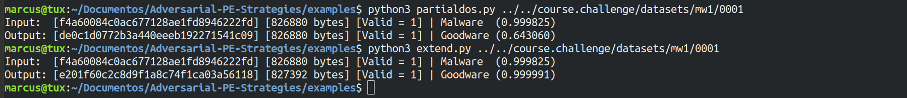

# Adversarial-PE-Strategies
A framework for attacking and defending adversarial PE malware detectors.

## Contributors
* Prof. Dr. Marcus Botacin (Lead)
* Parul Damahe
* Pranav Taukari
* Snehith Bikumandla

## Modules
* MalConv: MalConv detectors and attacks served by [secml_malware](https://github.com/pralab/secml_malware).
* NFS : ML detector powered by the [NeedForSpeed](https://github.com/fabriciojoc/2021-Machine-Learning-Security-Evasion-Competition) model.
* Angr: Binary analysis wrapper on the [angr](https://github.com/angr/angr) framework to provide CFG information for the attacks.

## How to Deploy (General Case)
* Enter each docker directory you want to use and build it with *docker build . -t <image_tag>* (or your configuration variation)
* Start each docker you want to use with *docker run -itp <local_port>:<docker_port> --rm -it <image_tag> python server.py* (or your deployment variation)
* Run your code. We suggest starting by the *examples*

## Running the examples
* Attacking
    * Choose one attack and pass a malware as argument. 


* Training
    * Pass *-m <malware_dir> -g <goodware_dir>* as arguments.

* Instantiating Models

```python:
from MalConv.Controller import *
malconv = MalConv()
detection, confidence = malconv.Detect(attack_payload)
```
## Applications

* Evaluating Attack Transferability

```python:
# Original Detection
detection, confidence = malconv.Detect(original_payload)
# Evasion Attack
attack_payload = malconv.PartialDOS(original_payload)
# Evading the original detector (MalConv)
detection, confidence = malconv.Detect(original_payload)
# Evades target model (NFS) ???
detection, confidence = nfs.Detect(original_payload)
```

# Contribution
* This work is an academic exercise and does not have production-quality code. Want to help us with code improvements? Send us a PR!
